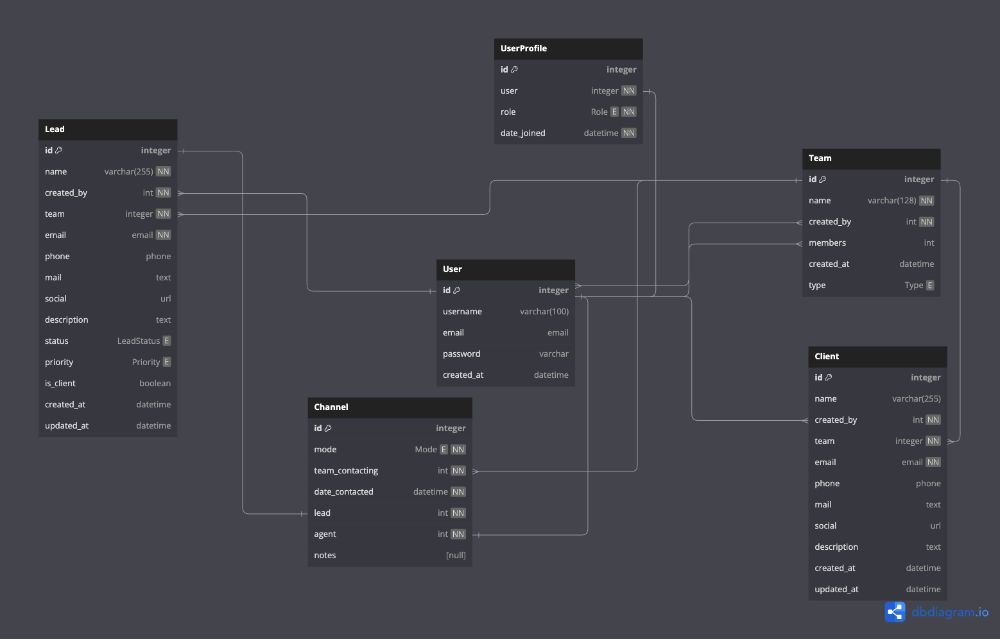
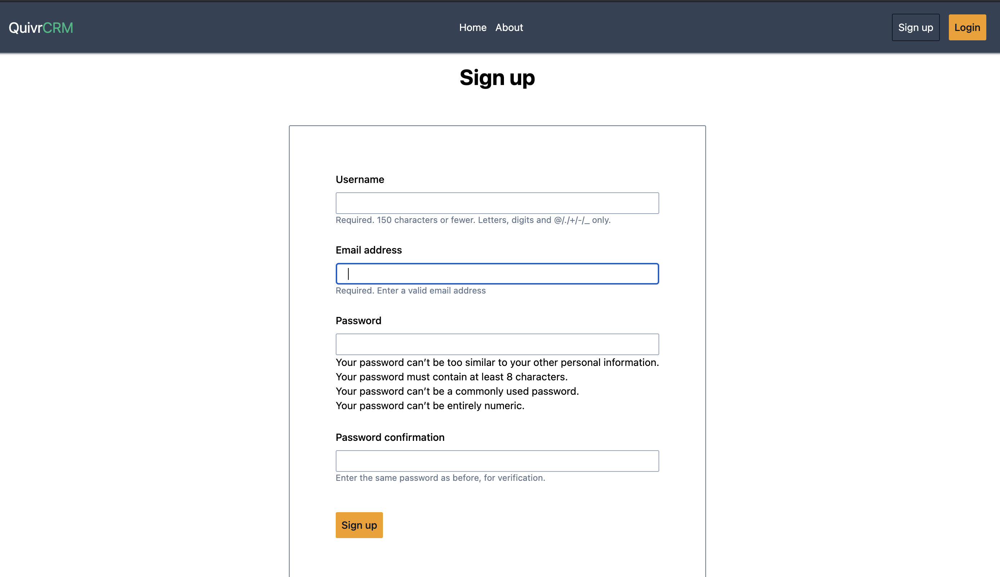
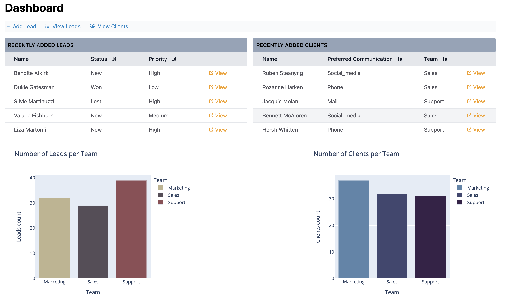
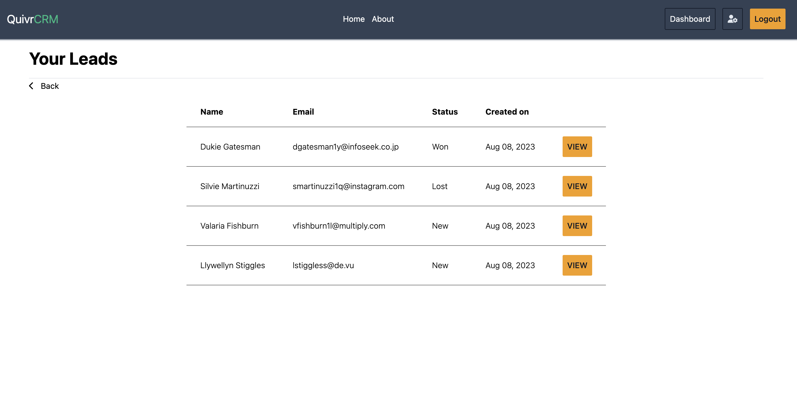

# QuivrCRM

A sample CRM project built with Django and Python. It seamlessly keeps track of leads and clients for the business. 
In addition, it also keeps track of how often leads and clients were communicated with.

QuivrCRM comes with built-in ability to register teams within the company and their respective roles.

## Database models
See below the ERD for the system.

## Sample Screens

### Libraries used:
- Django
- Tailwindcss
- Plotly
- Pandas
- HTMX